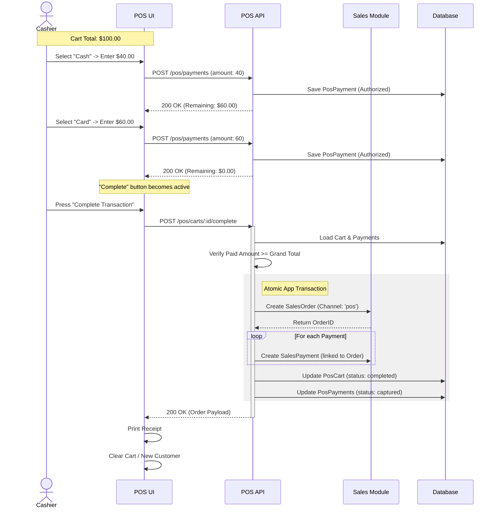
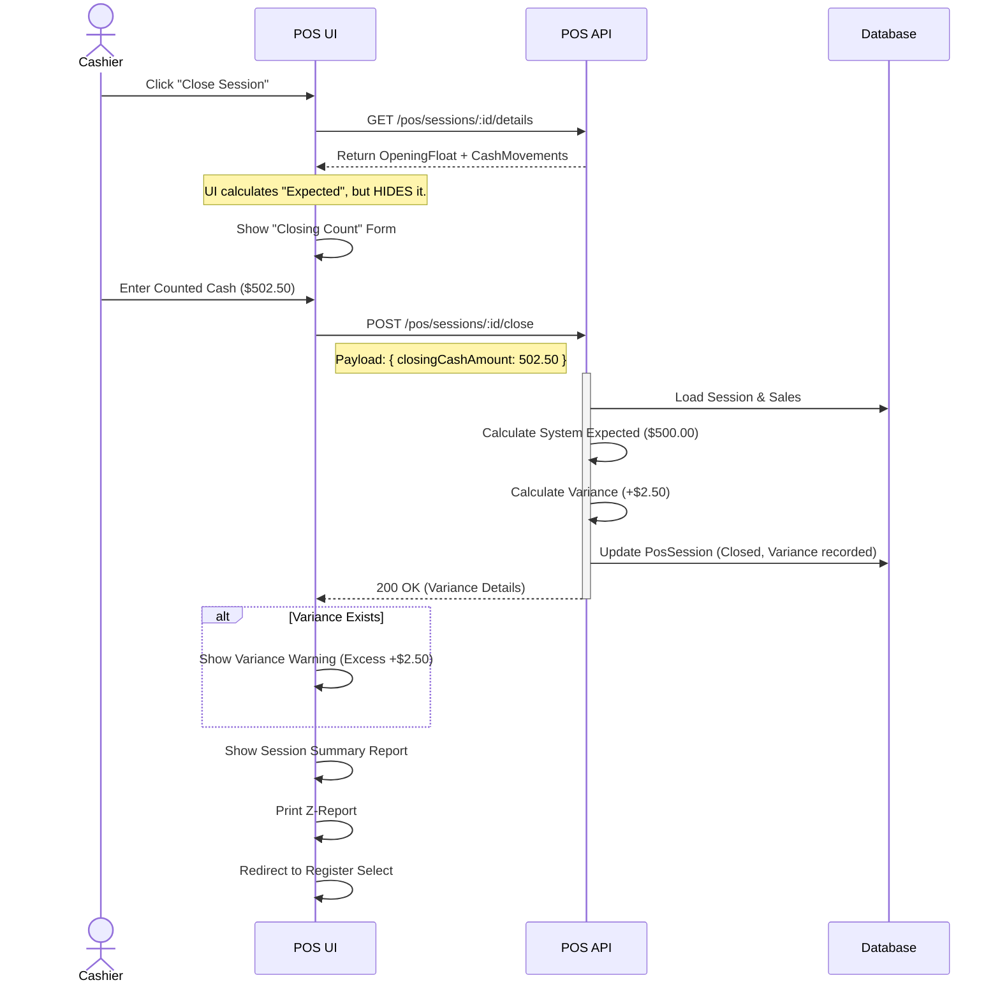
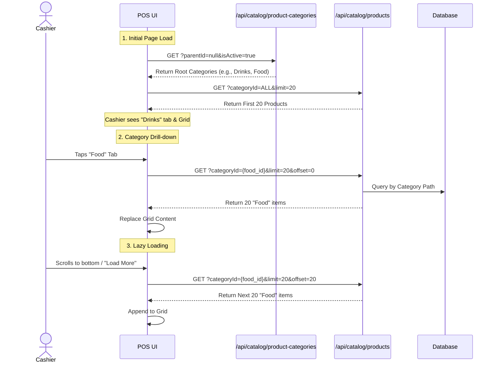

# POS Phase 1 Sequence Diagrams

## 1. Checkout Transaction (Online / Split Payment)

This flow illustrates a complex transaction with a "Split Payment" (Cash + Card) and how it creates the Sales Order in a transactional manner.

## 2. Session Reconciliation (Blind Count)

This flow shows the "Blind Count" security feature inspired by industry standards, ensuring the cashier counts the money *before* seeing what the system expects.

## 3. Visual Product Browsing (Category & Tiles)

This flow, defined in **SPEC-022a**, ensures we handle graphical browsing efficiently without overloading the client.

