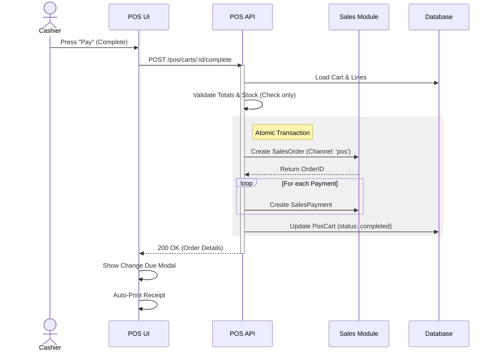

# POS Phase 1 Workflows & UI Analysis

## "Workflows" in POS Context

Based on the inspection of `packages/core/src/modules/workflows`, the existing workflow engine is a visual, graph-based tool. **For POS Phase 1, we do NOT need to use this engine.**

POS workflows are "operational procedures" executed by a cashier, optimized for speed, not "business process automation" graphs.

## Critical Phase 1 Workflows

These are the complex interactions that differ from standard Admin/E-commerce flows:

### 1. Checkout & Payment (The "Loop")
**Distinct UI Behavior:**
- **Mode**: "Head-down" entry.
- **Hardware Integration**: Global keyboard listener for Barcode Scanners (interpreting rapid keystrokes as a scan). **Note:** Direct hardware integration (WebUSB/Serial) is a Phase 3 non-goal, so we must rely on standard HID (Keyboard Emulation).
- **Virtual Keypad**: On-screen numpad for touchscreens (price overrides, quantity, cash entry).
- **Split Payment**: UI must dynamically update "Remaining Amount" as methods are added.

**Sequence Diagram Needed?**
**YES**. `pos.cart.complete` is the most complex operation. It bridges POS -> Sales -> Payments. We need to visualize the Transactional Boundary (ensure Order + Payment happens atomically).

### 2. Session Close (Reconciliation)
**Distinct UI Behavior:**
- **Wizard/Stepper**: Unlike the quick checkout, this should be a deliberate, multi-step modal:
    1.  Count Drawer (Blind count input).
    2.  Review Variance (System reveals expected vs. actual).
    3.  Confirm & Print Report.
- **Blocking**: A closed session must forcibly log the user out or redirect to the Session Select screen.

**Sequence Diagram Needed?**
**YES**. Visualizing how `opening_float` + `cash_sales` + `cash_movements` = `expected_cash` is calculated by the server vs. the client input.

### 3. Employee Switching (Pin Pad)
**Distinct UI Behavior:**
- **Overlay**: A persistent "Lock" or "Switch User" button that brings up a PIN pad overlay.
- **Fast Auth**: Validates hash locally or via quick API without full session cookie renegotiation (or managing sub-sessions).

**Sequence Diagram Needed?**
**NO**. Standard auth flow, just different UI.

## Industry Standard UX Learnings (Applied to Phase 1)

Based on industry standard POS research, we should adopt these specific behaviors:

### 1. Session Closing ("Bureaucracy Phase")
Standard POS systems treat session closing as a formal accounting event.
*   **Blind Count**: The system *knows* the expected cash (`opening + sales + in - out`), but the UI **must not** show it initially. The cashier must enter what they count.
*   **Variance Reveal**: Only *after* entry does the system reveal the difference.
*   **Denomination Widget**: Standard systems allow counting (5x $10, 3x $20). For Phase 1, we can simplify to a single "Total Counted" input, but the *flow* (Count -> Verify -> Close) is critical.

### 2. Split Payments
Modern POS systems support two types:
*   **By Amount (Phase 1 Target)**: User enters $50 cash -> System calculates remaining $24.50 -> User selects Card for remainder. **Critical UI**: Reactive "Remaining Due" display.
*   **By Item (Phase 2)**: Selecting specific items to pay separately. We should skip this complexity for now.

### 3. Weighted Products (Produce/Meat)
Common implementation handles this in two ways:
*   **Embedded Barcodes (Phase 1 Target)**: The scale prints a label with a specific prefix (e.g., `21xxxxxWWWWC`). The POS scans it, extracts the ID `xxxxx` and weight `WWWW`, and calculates the price automatically. **No UI interaction needed**.
*   **Integrated Scale (Phase 3)**: The POS reads weight directly from a USB scale.

### 4. Product Variants (Size/Color)
*   **Selection Workflow**: When a master product is clicked, a modal pops up to select attributes (Size: M, Color: Red).
*   **Phase 1 Approach**: We should treat variants as **separate searchable products** to avoid complex UI logic. If the user searches "Shirt", they see "Shirt (Red, M)", "Shirt (Red, L)". This simplifies the "Quick Add" flow.

### 6. Visual Browsing (Tile-based)
*   **User Need**: Fast product findings without typing (e.g., "Drinks" -> "Cola").
*   **Phase 1 Approach**: Fully specified in **SPEC-022a**.
    *   **Category Tabs**: Scrollable horizontal tabs for Root Categories.
    *   **Product Grid**: Image-based tiles.
    *   **Lazy Loading**: "Load More" button (Phase 1) vs Infinite Scroll (Phase 2).
    *   **Data Source**: Uses existing `CatalogProductCategory` hierarchy.

### 7. Security & Auto-Lock
*   **PIN Login**: Standard feature. Each cashier has a 4-6 digit PIN.
*   **Manual Lock**: Cashier clicks "Lock" icon to secure terminal.
*   **Auto-Lock (Inactivity)**: **Not native** (requires plugins), but highly recommended.
    *   **Phase 1 Requirement**: We should implement a client-side idle timer (e.g., 2 minutes) that overlays the PIN pad. This is a "Soft Lock" - it doesn't kill the session, just blocks the UI.

## Recommended Actions

1.  **Create Sequence Diagram**: `POS Checkout Transaction Flow` (Online).
2.  **Create Sequence Diagram**: `POS Session Reconciliation Flow` (focusing on the Blind Count logic).
3.  **UI Component**: Plan for a `VirtualNumpad` component (don't rely on native keyboard on tablets).
4.  **UI Component**: Implement `PosCategoryTabs` and `PosProductGrid` following **SPEC-022a**.
5.  **UI Behavior**: Plan for a `BarcodeListener` hook (detects high-speed input distinct from typing).
6.  **Data Logic**: Implement `BarcodeParser` service to handle "Embedded Weight" barcodes (Prefix `21` logic).
7.  **Security**: Implement `useIdleTimer` hook for auto-locking the UI.

---

### Proposed Sequence Diagram: POS Checkout (Phase 1 / Online)

